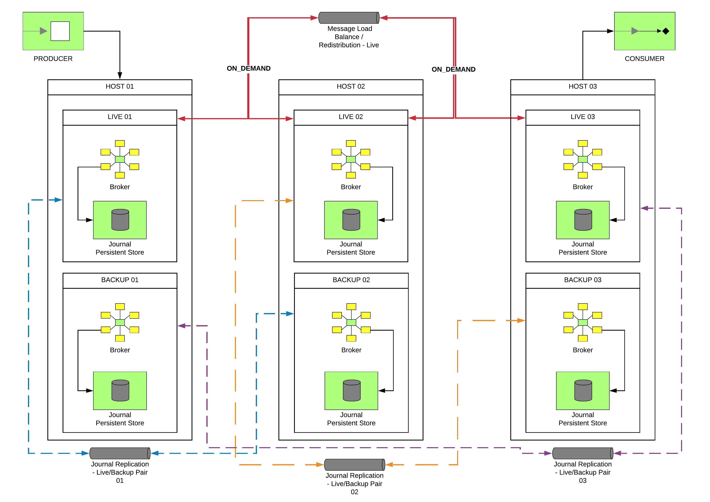
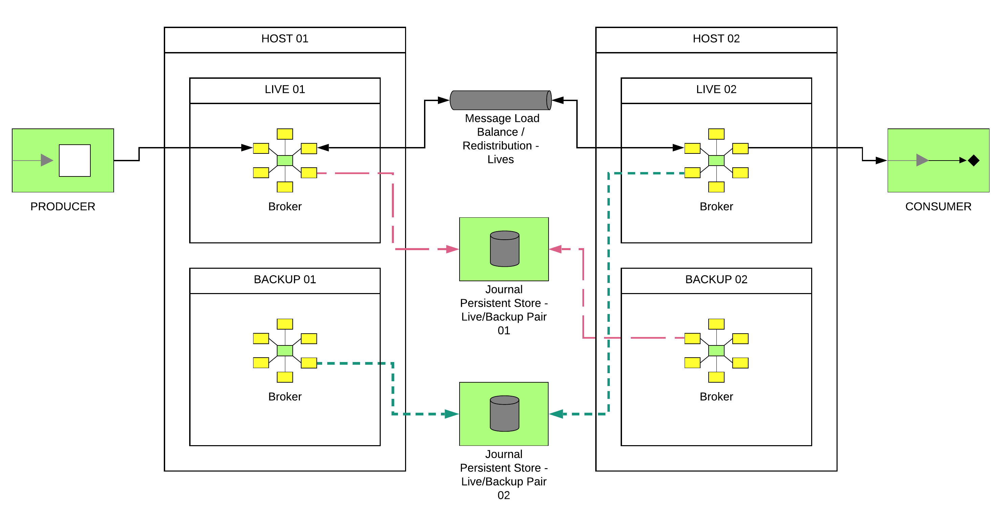

https://access.redhat.com/products/red-hat-amq#broker-gs[Red Hat AMQ Broker] is a high-performance messaging system
for highly scalable microservices or asynchronous messaging between different systems.

This cheat sheet includes the most common commands to install, deploy, administrate or
operate a messaging system based in Red Hat AMQ Broker.

== Cluster Topologies

Red Hat AMQ Broker allows defining different of topologies to build simple or complex messaging solutions. The most
standard topologies to cover High Availability, scalable and failover scenarios are:

* Symmetric cluster with Replicated journal
* Symmetric cluster with Shared journal

For other cluster topologies, review https://access.redhat.com/documentation/en-us/red_hat_amq/2021.q3/html-single/configuring_amq_broker/index#common-broker-cluster-topologies-configuring[Cluster Topologies].

=== Symmetric Cluster with Replicated Journal

Topology based in:

* Set of live brokers with network journal replication (Symmetric Cluster and High Availability)
* Set of backup brokers for the live brokers (Failover)

This diagram shows us this topology:

=== Symmetric Cluster with Shared Journal

Topology based in:

* Set of live brokers with a shared journal (Symmetric Cluster and High Availability)
* Set of backup brokers for the live brokers (Failover)

This diagram shows us this topology:

== Deploying Cluster Topologies

=== Deploying a Symmetric Cluster with Replicated Journal

This command will create a live broker instance in a replicated journal topology:

[,shell]
----
$ARTEMIS_HOME/bin/artemis create /opt/brokers/live-replicated-broker-XX \
  --http-host $HOSTNAME \
  --host $HOSTNAME \
  --aio \
  --clustered \
  --cluster-user $ARTEMIS_CLUSTER_USER \
  --cluster-password $ARTEMIS_CLUSTER_PASSWORD \
  --name live-replicated-broker-XX \
  --max-hops 1 \
  --user $ARTEMIS_ADMIN_USER \
  --password $ARTEMIS_ADMIN_PASSWORD \
  --require-login \
  --port-offset 0 \
  --no-autocreate \
  --replicated \
  --failover-on-shutdown
----

This other command will create a backup broker instance for a replicated journal topology:

[,shell]
----
$ARTEMIS_HOME/bin/artemis create /opt/brokers/backup-replicated-broker-XX \
  --http-host $HOSTNAME \
  --host $HOSTNAME \
  --aio \
  --clustered \
  --cluster-user $ARTEMIS_CLUSTER_USER \
  --cluster-password $ARTEMIS_CLUSTER_PASSWORD \
  --name live-replicated-broker-XX \
  --max-hops 1 \
  --user $ARTEMIS_ADMIN_USER \
  --password $ARTEMIS_ADMIN_PASSWORD \
  --require-login \
  --port-offset 0 \
  --no-autocreate \
  --replicated \
  --failover-on-shutdown \
  --slave
----

By default, Red Hat AMQ Broker will use a broadcast network to discover the instances of the topology. The
values are identified at runtime of the command and store them in the configuration files.

In case you need to identify the different instances of the topology, the `staticCluster` property
is needed. This property identifies the static list of other brokers of the topology.

[,shell]
----
  --staticCluster $ARTEMIS_STATIC_CLUSTER_LIST
----

Samples:

* *ARTEMIS_STATIC_CLUSTER_LIST*: `+tcp://live-broker-01:61616,...,tcp://live-broker-XX:61616+`

=== Deploying a Symmetric Cluster with Shared Journal

This command will create a live broker of a live/backup pair using a shared journal:

[,shell]
----
$ARTEMIS_HOME/bin/artemis create /opt/brokers/live-broker \
  --http-host $HOSTNAME \
  --host $HOSTNAME \
  --aio \
  --clustered \
  --cluster-user $ARTEMIS_CLUSTER_USER \
  --cluster-password $ARTEMIS_CLUSTER_PASSWORD \
  --name live-broker \
  --max-hops 1 \
  --user $ARTEMIS_ADMIN_USER \
  --password $ARTEMIS_ADMIN_PASSWORD \
  --require-login \
  --port-offset 0 \
  --no-autocreate \
  --data $ARTEMIS_SHARED_STORAGE_PATH \
  --shared-store \
  --failover-on-shutdown
----

For the backup broker instance:

[,shell]
----
$ARTEMIS_HOME/bin/artemis create /opt/brokers/backup-broker \
  --http-host $HOSTNAME \
  --host $HOSTNAME \
  --aio \
  --clustered \
  --cluster-user $ARTEMIS_CLUSTER_USER \
  --cluster-password $ARTEMIS_CLUSTER_PASSWORD \
  --name backup-broker \
  --max-hops 1 \
  --user $ARTEMIS_ADMIN_USER \
  --password $ARTEMIS_ADMIN_PASSWORD \
  --require-login \
  --port-offset 100 \
  --no-autocreate \
  --data $ARTEMIS_SHARED_STORAGE_PATH \
  --shared-store \
  --slave \
  --failover-on-shutdown \
----

Here, the key point is that `$ARTEMIS_SHARED_STORAGE_PATH` mount a shared storage between both
brokers. It is very common to use a NFSv4 mounted folder.

More details in https://access.redhat.com/documentation/en-us/red_hat_amq/2021.q3/html-single/configuring_amq_broker/index#assembly-br-persisting-message-data_configuring[Persisting message data].

== HA and Failover life cycle

Red Hat AMQ Broker includes a failover feature based in the combination of Live and Backup brokers. This
feature allows defining an automatic client failover connection.

A client can receive information about all live and backup brokers, so that in the event of a connection
failure, it can reconnect to the backup broker. The backup broker then automatically re-creates any sessions
and consumers that existed on each connection before failover. This feature saves you from having to
hand-code manual reconnection logic in your applications.

When a session is re-created on the backup, it does not have any knowledge of messages already sent or acknowledged.
Any in-flight sends or acknowledgements at the time of failover might also be lost. However, even without 100% transparent
failover, it is simple to guarantee once and only once delivery, even in the case of failure, by using a combination
of duplicate detection and retrying of transactions.

Client connection strings identify a connection string using the Core protocol with the right values to enable
the high availability and failover features from the client side. For example:

* Single broker: `tcp://HOSTNAME1:61616?ha=true&reconnectAttempts=10`
* Failover connection: `(tcp://HOSTNAME1:616161,tcp://HOSTNAME2:61616)?ha=true&reconnectAttempts=10`

Every time a live broker shutdown, the backup instance will be promoted as _lived_ instance to continue the
service to producers and consumers, and also to distribute the messages to other members of the topology. The
backup instance could delegate again the role to the live instance as soon is is ready. The following definition
in the backup instance automate that life cycle:

[,xml]
----
<ha-policy>
  <shared-store>
    <slave>
      <allow-failback>true</allow-failback>
    </slave>
  </shared-store>
</ha-policy>
----

More details in https://access.redhat.com/documentation/en-us/red_hat_amq/2021.q3/html-single/configuring_amq_broker/index#setting-up-broker-cluster-configuring[Setting up a broker cluster].

== Message Redistribution

https://access.redhat.com/documentation/en-us/red_hat_amq/2021.q3/html-single/configuring_amq_broker/index#assembly_br-enabling-message-redistribution_configuring[Enabling message redistribution]
between brokers in a cluster, the *redistribution-delay* property must be enabled to zero in
the `<address-setting>` in `broker.xml` file:

[,xml]
----
<!--default for catch all-->
<address-setting match="#">
  <redistribution-delay>0</redistribution-delay>
</address-setting>
----

== Protocols

Red Hat AMQ Broker has a pluggable protocol architecture, so that it can easily enable one or more protocols for
a network connection. The broker supports the following protocols:

* Core
* AMQP
* MQTT
* OpenWire
* STOMP
* HornetQ

Each protocol could be defined as secure channel (SSL). These channels could be used to define one-way or
two-ways to validate the communications from the clients.

More details in https://access.redhat.com/documentation/en-us/red_hat_amq/2021.q3/html-single/configuring_amq_broker/index#protocols[Protocols].

== Starting a broker

Start a broker instance is very simple:

[,shell]
----
$ARTEMIS_BROKER_INSTANCE_HOME/bin/artemis run
----

Or you can run the broker in the background using:

[,shell]
----
$ARTEMIS_BROKER_INSTANCE_HOME/bin/artemis-service start
----

== Installing as OS service (systemd)

Create a file called `artemis.service` file in the `/etc/systemd/system` folder. This file
will have the following content:

[,text]
----
[Unit]
Description = Red Hat AMQ Broker - Broker
After = syslog.target network.target

[Service]
ExecStart = /opt/brokers/live/bin/artemis run
ExecStop = /opt/brokers/live/bin/artemis stop

User = amq-broker
Group = amq-broker

SuccessExitStatus = 0 143
RestartSec = 60
Restart = on-failure

LimitNOFILE = 102642

[Install]
WantedBy = multi-user.target
----

To Enable the OS services:

[,shell]
----
systemctl enable artemis
----

To start, stop, check the status or restart the OS service:

[,shell]
----
systemctl (start|stop|status|restart) artemis
----

== Modularizing Broker Configuration

Red Hat AMQ Broker supports XML inclusions so the configuration can be broken out into separate files. It
is an interesting feature to prevent errors and to ease populating common configuration between
clustered brokers.

By default, the `etc/broker.xml` file declares `XInclude XML` namespace.

[,xml]
----
<configuration xmlns="urn:activemq"
           	xmlns:xsi="http://www.w3.org/2001/XMLSchema-instance"
           	xmlns:xi="http://www.w3.org/2001/XInclude"
                ...
----

For example, we could move the addresses tag to an external directory in each host. The live and backup brokers
of the same host will share an `addresses.xml` configuration file.

[,shell]
----
❯ cat /opt/brokers/config/addresses.xml
<addresses xmlns="urn:activemq:core">
    <address name="DLQ">
        <anycast>
            <queue name="DLQ" />
        </anycast>
    </address>
    <address name="ExpiryQueue">
        <anycast>
            <queue name="ExpiryQueue" />
        </anycast>
    </address>

    <!-- Queues and Topics -->
    <address name="SampleQueue">
        <anycast>
            <queue name="SampleQueue" />
        </anycast>
    </address>
    <address name="SampleTopic">
        <multicast/>
    </address>
</addresses>
----

This file must be copied in any Red Hat AMQ Broker cluster hosts. Finally each `broker.xml` file
will include it using the `xi:include` tag:

[,xml]
----
<xi:include href="/opt/brokers/config/addresses.xml"/>
----

*WARNING*:	External files are not monitored by the broker so it is needed to refresh or
restart it to take the latest status. `touch` command could be useful to modify the
timestamp of the `broker.xml` configuration file:

[,bash]
----
touch /opt/brokers/live/etc/broker.xml
----

== Automatic Configuration

Red Hat AMQ Broker is defined to automatically create an address/queue when a new sender/receiver is
connected. It is a great feature because it allows us to avoid having to manage the address in the
`broker.xml` file. Also Red Hat AMQ Broker also deletes an address/queue when there is
not a sender/receiver connected and there are no messages persisted. This feature is also
great however it includes some extra staff to manage this process.

The following properties in the `address-setting` section of `broker.xml` file manages the automatic configuration:

[,xml]
----
<address-setting match="#">
  <auto-create-addresses>false</auto-create-addresses>
  <auto-create-queues>false</auto-create-queues>
  <auto-create-jms-queues>false</auto-create-jms-queues>
  <auto-create-jms-topics>false</auto-create-jms-topics>
  <auto-delete-addresses>false</auto-delete-addresses>
  <auto-delete-queues>false</auto-delete-queues>
</address-setting>
----

More details in https://access.redhat.com/documentation/en-us/red_hat_amq/2021.q3/html-single/configuring_amq_broker/index#assembly-br-creating-and-deleting-addresses-and-queues-automatically_configuring[Automatic Configuration]

== Producer Command

To send messages to a resource (and easy way to test the broker):

[,bash]
----
./bin/artemis producer --url '$ARTEMIS_CORE_PROTOCOL_URL' \
  --destination $ARTEMIS_RESOURCE \
  --user $ARTEMIS_ADMIN_USER --password $ARTEMIS_ADMIN_PASSWORD \
  --message-size 1024 --message-count 10 --verbose
----

Where:

* *ARTEMIS_CORE_PROTOCOL_URL*: Identifies a connection string using the Core protocol. Valid values:
 ** Single broker: `tcp://HOSTNAME1:61616?ha=true&reconnectAttempts=10`
 ** Failover connection: `(tcp://HOSTNAME1:616161,tcp://HOSTNAME2:61616)?ha=true&reconnectAttempts=10`
* *ARTEMIS_RESOURCE*: Identifies the resource. Sample values for:
 ** A Queue: `queue://SampleQueue`
 ** A Topic: `topic://SampleTopic`

== Consumer Command

To consume messages from a resource (and easy way to test the broker):

[,bash]
----
./bin/artemis consumer --url '$ARTEMIS_CORE_PROTOCOL_URL' \
  --destination $ARTEMIS_RESOURCE \
  --user $ARTEMIS_ADMIN_USER --password $ARTEMIS_ADMIN_PASSWORD \
  --message-count 10 --verbose
----

Where:

* *ARTEMIS_CORE_PROTOCOL_URL*: Identifies a connection string using the Core protocol. Valid values:
 ** Single broker: `tcp://HOSTNAME1:61616?ha=true&reconnectAttempts=10`
 ** Failover connection: `(tcp://HOSTNAME1:616161,tcp://HOSTNAME2:61616)?ha=true&reconnectAttempts=10`
* *ARTEMIS_RESOURCE*: Identifies the resource. Valid values:
 ** Queue: `queue://SampleQueue`
 ** Topic: `topic://SampleTopic`

== Durable Subscription Queue

The broker saves messages for any inactive subscribers when a queue is configured as a Durable Subscription. The
broker delivers them to the subscribers when they reconnect. Clients are therefore guaranteed to receive
each message delivered to the queue after subscribing to it.

A sample definition will be similar to:

[,xml]
----
<address name="topic">
  <multicast>
    <queue name="subscription1">
      <durable>true</durable>
    </queue>
    <queue name="subscription2">
      <durable>true</durable>
    </queue>
  </multicast>
</address>
----

This is a sample definition of a Durable Subscription Queue to be used with the Artemis producer and consumer commands:

[,xml]
----
<address name="topic.events">
  <multicast>
    <queue name="c1.Consumer ActiveMQTopic[topic.foo], thread=0">
      <durable>true</durable>
    </queue>
    <queue name="c2.Consumer ActiveMQTopic[topic.foo], thread=0">
      <durable>true</durable>
    </queue>
  </multicast>
</address>
----

This command produces a number of messages to the topic:

[,bash]
----
./bin/artemis producer --url tcp://$HOSTNAME:5672 \
  --user admin --password admin \
  --protocol amqp \
  --destination topic://topic.events \
  --threads 1 \
  --message-count 100 \
  --text-size 1024
----

This command consumes the messages from the `c1` subscription:

[,bash]
----
./bin/artemis consumer --url tcp://$HOSTNAME:5672 \
  --user admin --password admin \
  --protocol amqp \
  --destination topic://topic.events \
  --threads 1 \
  --message-count 100 \
  --durable \
  --clientID c1
----

This other command consumes the messages from the `c2` subscription:

[,bash]
----
./bin/artemis consumer --url tcp://$HOSTNAME:5672 \
  --user admin --password admin \
  --protocol amqp \
  --destination topic://topic.events \
  --threads 1 \
  --message-count 100 \
  --durable \
  --clientID c2
----

*NOTE*: These queues could be consumed using JMS Message Consumers using
https://access.redhat.com/documentation/en-us/red_hat_amq/2021.q3/html-single/configuring_amq_broker/index#proc-br-specifying-a-fully-qualified-queue-name_configuring[Fully Qualified Queue Names (FQQN)] as:

[,java]
----
String FQQN = "topic::subscription1";
Queue queueDestination session.createQueue(FQQN);
MessageConsumer consumer = session.createConsumer(queueDestination);
----

More details in https://access.redhat.com/documentation/en-us/red_hat_amq/2021.q3/html-single/configuring_amq_broker/index#assembly-br-configuring-addresses-and-queues_configuring[Addressing Model].

== Clustered Message Grouping

This feature allows to process messages with a particular group ID in the same order by the
consumers. Each clustered broker therefore uses a grouping handler to manage the complexity of routing
of grouped messages. Each clustered broker should choose should choose a grouping handler type: `Local` or `Remote`.

Local grouping handler broker (only one per cluster topology):

[,xml]
----
<grouping-handler name="my-grouping-handler">
	<type>LOCAL</type>
	<address>SampleQueue</address>
	<timeout>5000</timeout>
</grouping-handler>
----

Remote grouping handler broker (the rest of instances of the cluster topology):

[,xml]
----
<grouping-handler name="my-grouping-handler">
  <type>REMOTE</type>
  <address>SampleQueue</address>
  <timeout>5000</timeout>
</grouping-handler>
----

To produce grouped messages:

[,bash]
----
./bin/artemis producer --url $ARTEMIS_CORE_PROTOCOL_URL \
  --destination $ARTEMIS_RESOURCE \
  --user $ARTEMIS_ADMIN_USER --password $ARTEMIS_ADMIN_PASSWORD \
  --message "Sample Grouped Message" \
  --message-count 10 \
  --group mygroup
----

To consume grouped messages:

[,bash]
----
./bin/artemis consumer --url $ARTEMIS_CORE_PROTOCOL_URL \
  --destination $ARTEMIS_RESOURCE \
  --user $ARTEMIS_ADMIN_USER --password $ARTEMIS_ADMIN_PASSWORD \
  --message-count 10 \
  --verbose
----

More details in https://access.redhat.com/documentation/en-us/red_hat_amq/2021.q3/html-single/configuring_amq_broker/index#configuring-clustered-message-grouping-configuring[Clustered Message Grouping]

== AMQP Secured Connection

Client connection string for AMQP secure protocol:

[,text]
----
amqps://HOSTNAME:5671?sslEnabled=true&transport.trustAll=true&transport.verifyHost=false
----

More details in https://access.redhat.com/documentation/en-us/red_hat_amq/2021.q3/html-single/configuring_amq_broker/index#protocols[Configuring Protocols]

== Monitoring

Red Hat AMQ Broker includes https://jolokia.org/[Jolokia] endpoints to execute administrative tasks
or query administrative information.

Samples:

* Query the up time of the broker:

[,bash]
----
❯ curl -u admin:admin 'http://localhost:8161/console/jolokia/read/org.apache.activemq.artemis:broker=!%22live!%22/Uptime' | jq
{
  "request": {
    "mbean": "org.apache.activemq.artemis:broker=\"live\"",
    "attribute": "Uptime",
    "type": "read"
  },
  "value": "1 minute",
  "timestamp": 1653917729,
  "status": 200
}
----

* Query to get the total number of messages added:

[,bash]
----
❯ curl -u admin:admin 'http://localhost:8161/console/jolokia/read/org.apache.activemq.artemis:broker=!%22live!%22/TotalMessagesAdded' | jq
{
  "request": {
    "mbean": "org.apache.activemq.artemis:broker=\"live\"",
    "attribute": "TotalMessagesAdded",
    "type": "read"
  },
  "value": 700,
  "timestamp": 1653917823,
  "status": 200
}
----

== Performance and Limits

Red Hat AMQ Broker manages several resources (descriptors, connections, ...) and it is needed
to define the OS limits to allow it for the user that runs it.

Review the `/etc/security/limits.conf` file to add the following definition for this user:

[,text]
----
amq-broker    	soft	nofile      	65001
amq-broker    	hard	nofile      	65001
----

*WARNING*: In RHEL 8 this step is no longer needed since `nofile` defaults have been increased to 1048576 max open files.

Red Hat AMQ Broker includes a general server thread pool used for most asynchronous actions on the
server side. This pool is defined by default to use only 30 threads and it is very useful to improve the performance.

Definition at `broker.xml` file:

[,xml]
----
<thread-pool-max-size>120</thread-pool-max-size>
----

There are a few things that can go wrong in a production environment (bugs, IO errors, memory issues, ...),
so Red Hat AMQ Broker includes a protection to shut itself down when bad things happen
(as a safeguard). This method includes different policies:

* *LOG* (default): Log messages into `artemis.log` to inform that something is wrong.
* *HALT* (default at broker creation): Stop the messaging process but not the VM.
* *SHUTDOWN*: Shutdown the VM process.

To check easily if a broker suffered an issue the best practice is to use `SHUTDOWN` policy. It is
very easy to check if the broker is running or not checking the service or the java process in OS.

Definition at `broker.xml` file:

[,xml]
----
<critical-analyzer-policy>SHUTDOWN</critical-analyzer-policy>
----

More details about performance, tunning and extra features, please review the following references:

* https://access.redhat.com/documentation/en-us/red_hat_amq/2021.q3/html-single/managing_amq_broker/index#assembly-br-monitoring-brokers-for-problems_managing[Monitoring Brokers for Problems]

== Managing users

Add a user:

[,bash]
----
./bin/artemis user add --url $ARTEMIS_CORE_PROTOCOL_URL \
  --user admin --password admin \
  --user-command-user user1 \
  --user-command-password user1-password1 \
  --role role1
----

Reset a user (change user password and/or role/s):

[,bash]
----
./bin/artemis user reset --url $ARTEMIS_CORE_PROTOCOL_URL \
  --user admin --password admin \
  --user-command-user user1 \
  --user-command-password user1-password2 \
  --role role2,role3
----

Remove a user:

[,bash]
----
./bin/artemis user rm --url $ARTEMIS_CORE_PROTOCOL_URL \
  --user admin --password admin \
  --user-command-user user1
----

== Mask passwords

To mask password to be added in `broker.xml` file:

[,bash]
----
$ARTEMIS_HOME/bin/artemis mask $PASSWORD
----

More details in https://access.redhat.com/documentation/en-us/red_hat_amq/2021.q3/html-single/configuring_amq_broker/index#assembly-br-encypting-passwords-in-configuration-files_configuring[Encrypting passwords in configuration files].

== Getting more Help

Red Hat AMQ Broker CLI tool includes an option to get in line help and documentation for each
command implemented.

To get detailed information of any kind of command:

[,shell]
----
./bin/artemis help COMMAND
----

== Red Hat AMQ Broker version

This cheat-sheet was tested and verified with the Red Hat AMQ Broker 7.9 version.
