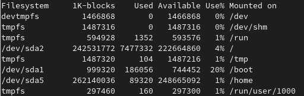
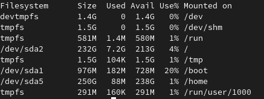
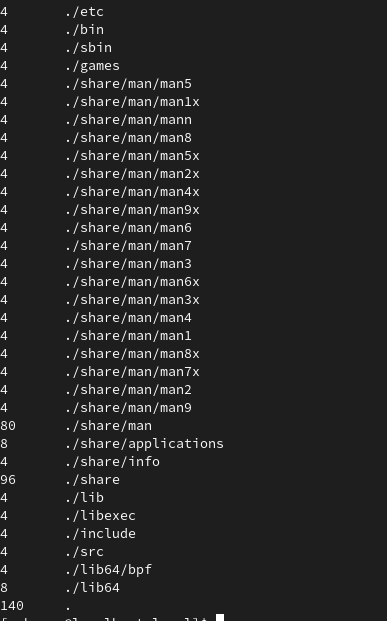
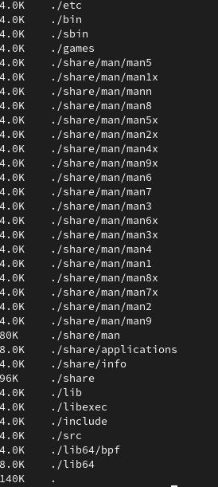

= Linux Intermediate
:experimental: true
:product-name:

This cheat sheet introduces you to more Linux commands that every developer/sysadmin should know.

== more

`more` command lets you view output in a scrollable manner.

[source, bash]
----
more /etc/passwd

ls -ll | more
----

* Up arrow and Down arrow let you scroll through the output.
* `Space` key scrolls down one page.
* `b` key scrolls up one page.
* `/` search in the text.

== sed

`sed` is used among other things to apply substitution, find or replace files content.

[source, bash]
----
sed 's/blue/red/' colors.txt # changes the first occurrence in each line containing the blue word to red

sed 's/blue/red/2' colors.txt # changes the second occurrence in each line containing the blue word to red

sed 's/blue/red/g' colors.txt # changes all the occurrences containing the blue word to red

sed '1,3 s/blue/red/g' colors.txt # changes all the occurrences from line number 1 to 3 containing the blue word to red

sed '5d' colors.txt # deletes line number 5

sed '12,$d' colors.txt # deletes from line 12 to last line
----

The `sed` command also supports regular expression.

== awk

`awk` is a text manipulation tool implementing a powerful scripting language.

[source, bash]
----
awk '/red/ {print}' colors.txt # prints lines matching the given pattern

awk '{print $1,$4}' colors.txt # split each line in columns (whitespace as separator) and prints column 1 and 4

awk 'NR==3, NR==6 {print NR,$0}' colors.txt  # prints from line 3 to 6 prefixed with the line number (NR)

awk 'NR > 1 {print}' colors.txt # prints from line 2 to end of file
----

== top

`top` command shows the Linux processes providing a dynamic real-time view of the system.

[source, bash]
----
top

top -u # order process by CPU usage
top -o mem # order process by memory
top -n 5 # only shows 5 processes 
----

image::images/top.png[]

== find

`find` command is used to search and locate files or directories that meet certain conditions.

[source, bash]
----
find /home -name users.txt # finds users.txt file under /home and deep

find /home -iname users.txt # finds users.txt file ignoring case under /home and deep

find . -type f -name "*.java" # finds all Java files from current dir and deep

find / -type f -perm 0777 # finds all files 

find / -perm /a=x # finds all executable files

find /home -user asotobu # finds all files that belong to asotobu

find /home -group developer # finds all files that belong to the developer group

find / -mtime 10 # finds all files modified in the last 10 days

find / -amin -10 # finds all files accessed in the last 10 minutes
----

== pwd

`pwd` prints the current working directory.

[source, bash]
----
pwd

/home/asotobu/git
----

== df

`df` gets a summary of available and used disk space usage of the file system.

[source, bash]
----
df
----

Disk space in human-readable format.

[source, bash]
----
df -h
----

== du

`du` is used to check the information of disk usage of files and directories.

[source, bash]
----
du
----

Disk space in human-readable format.

[source, bash]
----
du -h 
----

== diff

This command displays the differences in the files by comparing the files line by line.

Symbols are:

* `a` for add
* `c` for change
* `d` for delete

[source, bash]
----
diff first.txt second.txt

2,3d1
< mv
< comm
4a3,4
> diff
> comm
----

`2,3d1` means from line 2 to 3 in file 1 needs to be delated to match line 1 of the second file.

`4a2,3` means that line 4 in file 1 need to add lines 3 and 4 from the second file.

[source, bash]
----
diff -c first.txt second.txt

*** first.txt	Mon Feb  8 16:28:26 2021
--- second.txt	Mon Feb  8 16:28:38 2021
***************
*** 1,4 ****
  cat
- mv
- comm
 cp
--- 1,4 ----
cat
 cp
+ diff
+ comm
----

== alias

Aliases are custom shortcuts to Linux commands.
Some aliases are provided by out-of-the-box:

[source, bash]
----
alias

l='ls -lah'
la='ls -lAh'
ll='ls -lh'
ls='ls -G'
lsa='ls -lah'
md='mkdir -p'
----

To create custom aliases:

[source, bash]
----
alias k=kubectl
----

== ping

`ping` checks network connectivity issues by sending one or more ICMP Echo Request packages to a specified destination IP.

[source, bash]
----
ping google.com

PING google.com (216.58.211.238): 56 data bytes
64 bytes from 216.58.211.238: icmp_seq=0 ttl=116 time=10.584 ms
64 bytes from 216.58.211.238: icmp_seq=1 ttl=116 time=11.002 ms
64 bytes from 216.58.211.238: icmp_seq=2 ttl=116 time=10.802 ms
----

[source, bash]
----
ping –c 2 google.com # sends only 2 packets

ping –w 25 google.com # sends packets during 25 seconds

ping –i 0.5 google.com # sends packets with an interval of 0.5 seconds
----

== traceroute

`traceroute` elicits a response from the router at each hop from your computer to the destination.

[source, bash]
----
traceroute google.com

 1  192.168.1.1 (192.168.1.1)  0.708 ms  0.479 ms  1.094 ms
 2  239.red-81-46-38.customer.xxxxxxxxxx.net (81.46.38.239)  2.685 ms  1.551 ms  2.544 ms
 3  166.red-81-46-45.customer.xxxxxxxxxx.net (81.46.45.166)  10.314 ms  12.277 ms  13.097 ms
 4  * 241.red-81-46-45.customer.xxxxxxxx.net (81.46.45.241)  26.055 ms  15.976 ms
 5  * * *
 6  176.52.253.93 (176.52.253.93)  10.825 ms  10.848 ms  11.337 ms
 7  72.14.211.154 (72.14.211.154)  11.168 ms
    5.53.1.74 (5.53.1.74)  10.799 ms
    72.14.211.154 (72.14.211.154)  11.604 ms
 8  * * *
 9  108.170.253.241 (108.170.253.241)  12.260 ms
    142.250.62.202 (142.250.62.202)  12.149 ms
    209.85.142.100 (209.85.142.100)  11.195 ms
10  108.170.253.247 (108.170.253.247)  13.657 ms
    108.170.253.229 (108.170.253.229)  13.035 ms
    74.125.253.197 (74.125.253.197)  11.983 ms
11  mad07s09-in-f14.1e100.net (172.217.17.14)  10.121 ms
    74.125.37.217 (74.125.37.217)  11.999 ms
    mad07s09-in-f14.1e100.net (172.217.17.14)  10.890 ms
----

== nslookup

`nslookup` displays DNS details.

[source, bash]
----
nslookup google.com
Server:		80.58.61.254
Address:	80.58.61.254#53

Non-authoritative answer:
Name:	google.com
Address: 216.58.211.238
----

== hostname

`hostname` shows the computer’s hostname and domain name.

[source, bash]
----
hostname

localhost.localdomain

hostname -I # display all the network addresses

10.0.2.15
----

== history

`history` command shows all of the last commands that have been recently used.

[source, bash]
----
history

9982  pwd
9983  cd ..
9984  cd tmp9
9985  vi first.txt
9986  vi second.txt
9987  diff first.txt second.txt
9988  diff -c first.txt second.txt
9989  ping google.com
9990  uname -a
9991  traceroute
9992  traceroute google.com
9993  ll
9994  alias
9995  finger
9996  groups
9997  nslookup google.com
9998  sestatus
9999  hostname -d
10000  hostname -A
10001  code .
----

You can run any of the commands by appending exclamation (`!`) to the number of the command (i.e `!9982` runs `pwd`).

== uname

`uname` displays basic information about the operating system and hardware.

[source, bash]
----
uname
Linux

uname -a 
Linux localhost.localdomain 5.8.15-301.fc33.x86_64 # SMP Thu Oct 15 16:58:06 UTC 2020 x86_64 x86_64 x86_64 GNU/Linux
----

== sestatus

`sestatus` shows the current status of the SELinux.

[source, bash]
----
sestatus

SELinux status:                 enabled
SELinuxfs mount:                /sys/fs/selinux
SELinux root directory:         /etc/selinux
Loaded policy name:             targeted
Current mode:                   enforcing
Mode from config file:          enforcing
Policy MLS status:              enabled
Policy deny_unknown status:     allowed
Memory protection checking:     actual (secure)
Max kernel policy version:      28
----

== finger

`finger` shows user information of all the users logged in. 

[source, bash]
----
finger

Login    Name                 TTY  Idle  Login  Time   Office  Phone
asotobu  Alex Soto            tty2  9:51  Mon    09:26
----

== groups

`groups` prints the names of the primary and any supplementary groups of a username or of the current process.

[source, bash]
----
groups

osboxes wheel

groups root # set groups of a given username

root : root
----

== useradd

`useradd` command creates a new user on the Linux system.

[source, bash]
----
sudo useradd alex

sudo useradd -m alexandra # creates the user with home directory

sudo useradd -u 1500 ada # creates the user with User Id

sudo useradd -g users alex # creates the user with Group Id

sudo useradd -g users -G wheel,developers alex # creates the user with primary and secondary groups

sudo useradd -s /usr/bin/zsh alex # creates the user with specific shell
 
sudo useradd -e 2019-01-22 alex # creates atheuser with the expiration date
----

== groupadd

`groupadd` command creates a new group account on the Linux system.

[source, bash]
----
sudo groupadd developers 

sudo groupadd -g 1010 mygroup # creates the group with Group Id

sudo groupadd -K GID_MIN=500 -K GID_MAX=700 mygroup # creates the group overriding /etc/login.defs values 
----

== userdel

`userdel` deletes a user account and related files.

[source, bash]
----
sudo userdel -f dev

sudo userdel -r newuser2 # user's home directory is removed
----